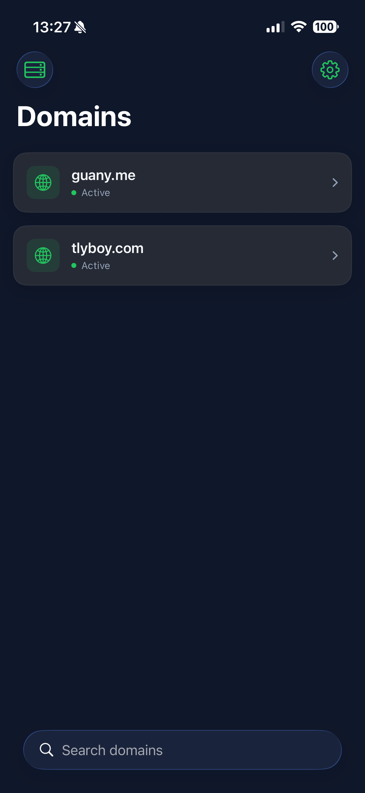
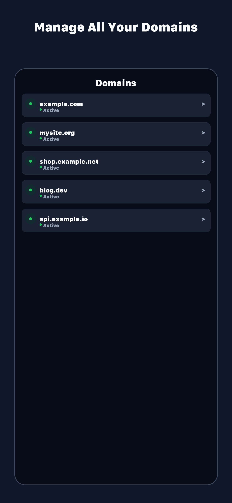
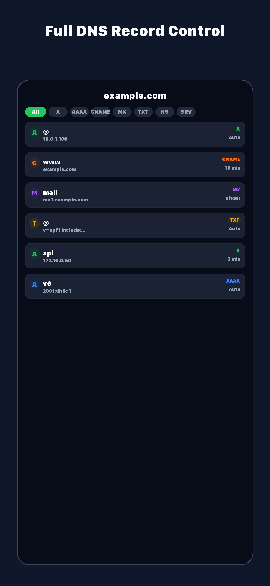
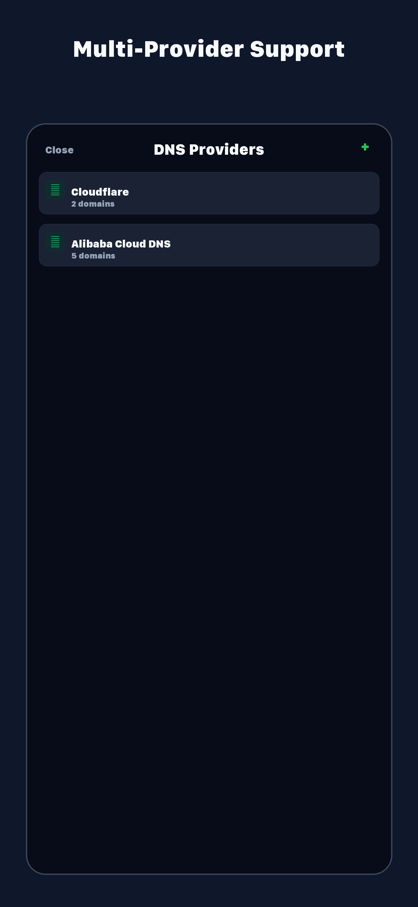
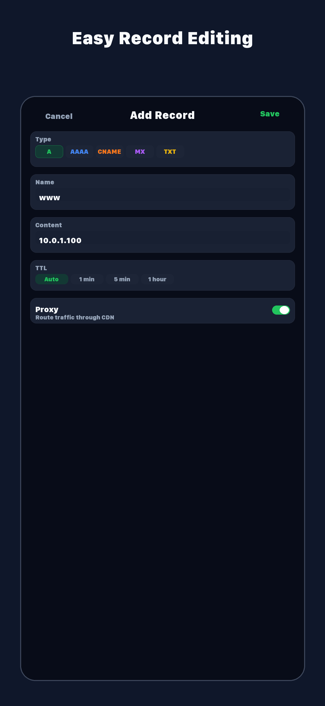

# GlassDNS

🌐 A mobile DNS configuration tool for iOS with Liquid Glass UI

<div align="center"></div>

| Category | Stack |
| -------- | ----- |
| Platform | iOS 26+ |
| Framework | SwiftUI |
| Language | Swift 5 |
| Design | Liquid Glass / Glassmorphism |

## Install

### Requirements

- Xcode 16+
- iOS 26.0+
- Apple Developer account (for device deployment)

### Build from Source

```bash
git clone https://github.com/tlyboys/GlassDNS.git
cd GlassDNS
open GlassDNS.xcodeproj
```

Select your target device or simulator in Xcode, then press `Cmd + R` to build and run.

## Usage

### Supported Providers

- **Cloudflare** — API Token authentication
- **Alibaba Cloud DNS** — AccessKey ID + Secret authentication

### Getting Started

1. Launch the app and tap **Add Provider**
2. Select your DNS provider (Cloudflare or Alibaba Cloud)
3. Enter your API credentials
4. The app verifies your credentials, then loads your domains

### DNS Record Management

- View all DNS records for any domain
- Filter records by type (A, AAAA, CNAME, MX, TXT, NS, SRV)
- Search records by name or content
- Add, edit, and delete DNS records
- Pull to refresh for latest data

### Features

- **Multi-provider** — Manage multiple DNS providers in one app
- **Secure storage** — API keys stored in iOS Keychain, never leaves your device
- **Bilingual** — English and Chinese (Simplified), switchable in settings
- **Dark theme** — Deep blue glassmorphism UI with green accents

### Screenshots

<p>
  
  
  
  
</p>

## License

[MIT](https://opensource.org/licenses/MIT) © tlyboy
